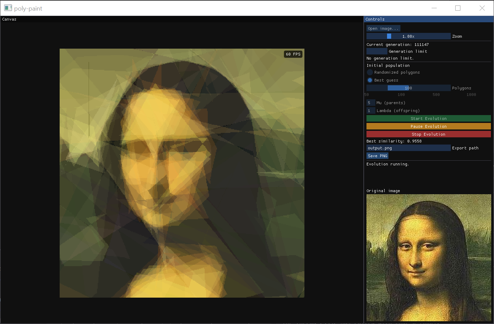

# poly-paint

`poly-paint` is a native C++ application that recreates a reference image with
evolving, semi-transparent polygons. Load an image, choose the initial
population and evolution settings, then let the optimizer iteratively improve a
polygon-based approximation that can be exported as a PNG.



## What it does

- Opens a target image through a native file picker and displays both the
  original and current polygon approximation.
- Evolves polygon collections in the background and reports the generation and
  best similarity score as it runs.
- Supports randomized and contrast-aware \"best guess\" starting populations.
- Lets you choose 50, 100, 500, or 1,000 polygons; set parent and offspring
  population sizes; optionally pause at a generation limit; and pause, resume,
  or stop a run.
- Provides canvas zoom and saves the current approximation to a PNG file.
- Uses AVX2 pixel kernels by default, with a portable scalar alternative.

## Example

The following reference image can be approximated by an evolving polygon
collection:


## Build

The project requires CMake and a C++23-capable compiler. The first configure
step fetches the project dependencies from GitHub.

### clang

```powershell
cmake --preset clang-release
cmake --build --preset build-clang-release
.\build\clang-release\poly_paint.exe
```

### MSVC / Visual Studio 2022

```powershell
cmake --preset msvc-release
cmake --build --preset build-msvc-release
.\build\msvc-release\Release\poly_paint.exe
```

Run the core regression tests after either build:

```powershell
ctest --test-dir build\msvc-release -C Release --output-on-failure
```

To disable AVX2 and build with portable scalar kernels, configure with
`-DPOLY_PAINT_ENABLE_AVX2=OFF`.

## Tech

The interface is built with Dear ImGui, GLFW, and OpenGL 3.3. Image loading and
PNG export use stb, and evolution work is coordinated on background threads.

## License

Released under the [MIT License](LICENSE).
